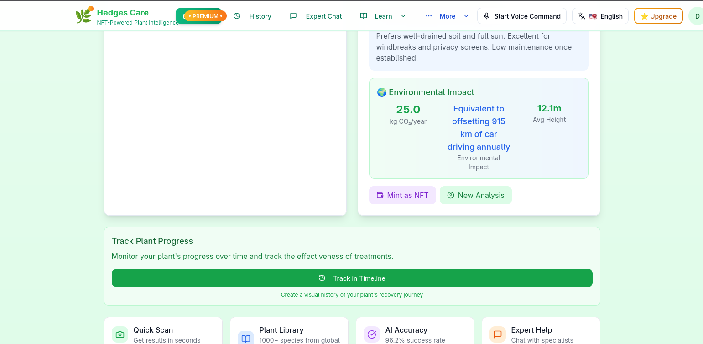
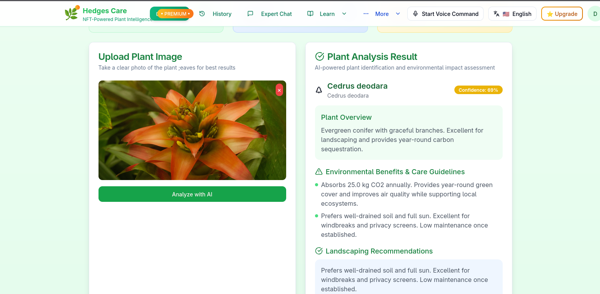
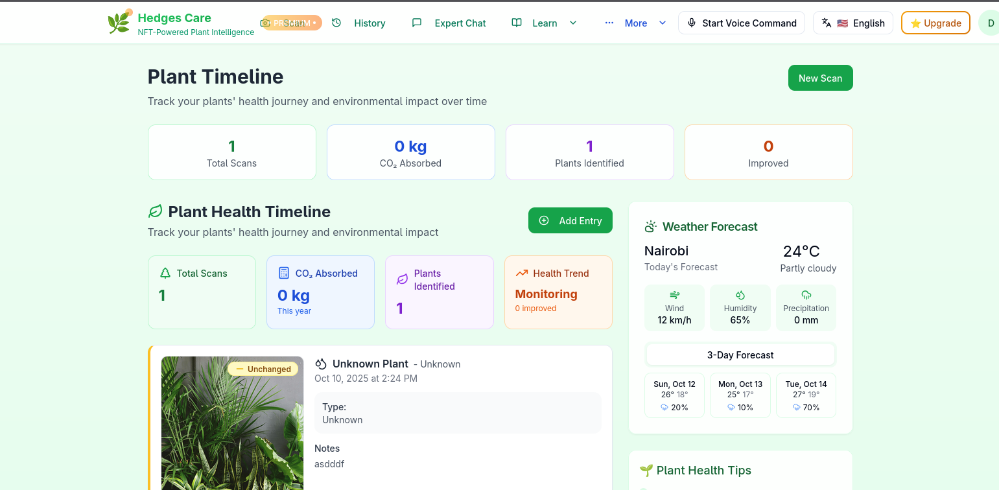
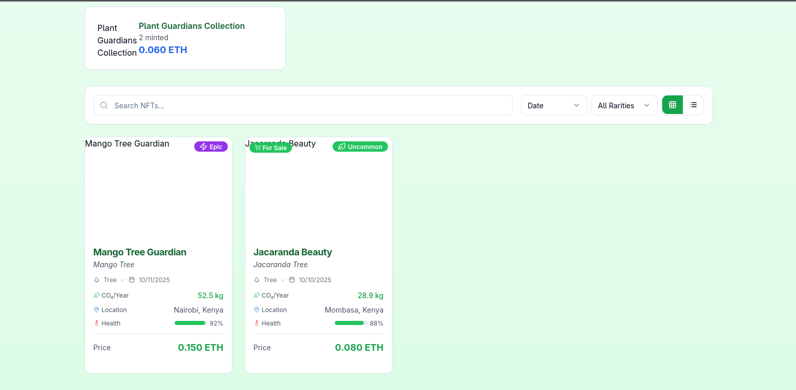
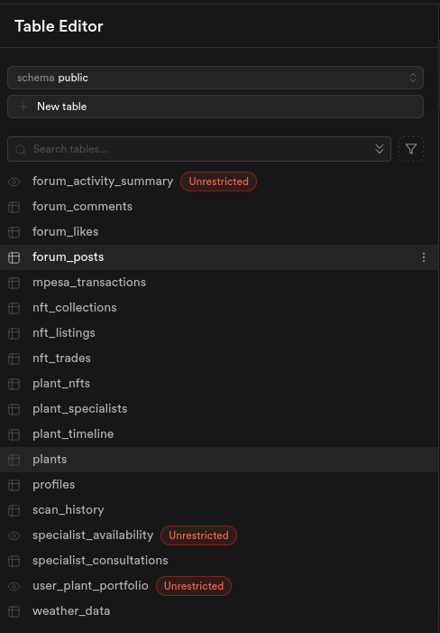

# 🌿Hedges Care 🤖

<p align="center">
  <a href="https://your-demo-url.com/">
    
  </a>
  <a href="https://github.com/your-username/hedges-care/blob/main/LICENSE">
    
  </a>
  <a href="https://github.com/your-username/hedges-care/stargazers">
    
  </a>
  <a href="https://github.com/your-username/hedges-care/network/members">
    
  </a>
  <a href="https://www.undp.org/sustainable-development-goals">
    
  </a>
</p>

Welcome to **Hedges Care** — your AI-powered assistant for diagnosing plant diseases, measuring CO2 absorption, and connecting with landscaping experts! 🌱🌍

> "Revolutionizing plant healthcare while contributing to UN SDG 15: Life on Land through intelligent carbon footprint management!"

## [🎯 Pitch Deck](https://gamma.app/docs/Hedges-Care-Revolutionizing-Plant-Health-and-Carbon-Sequestration-Throug)

---

## 🌟 Introduction

**Hedges Care** is an innovative UN SDG 15-focused platform designed for homeowners, gardeners, and landscaping professionals to **manage plant health** and **measure environmental impact** using cutting-edge **machine learning** and **computer vision**. With just a snap 📸, get instant diagnoses, CO2 absorption analysis, and expert-validated treatment plans.

🌍 Join our mission to promote biodiversity, carbon sequestration, and sustainable landscaping practices while building a community of environmental stewards! 🙌

---

## 🌍 UN SDG 15 Alignment

We're committed to **UN SDG 15: Life on Land** by:
- 🌱 **Promoting biodiversity** through proper plant healthcare
- 🌳 **Measuring carbon sequestration** of your plants and hedges
- 🏡 **Enabling sustainable landscaping** practices
- 🔄 **Reducing environmental impact** through data-driven insights
- 🌿 **Supporting ecosystem restoration** through informed plant care

---

## 🧠 Tech Stack ⚒

Here's what's under the hood 🛠️:

- **Frontend**: React/ TypeScript/ Tailwind CSS/ ShadCn (mobile-first)
- **Backend**: Supabase
- **AI/ML Models**: TensorFlow/ PyTorch (CNN-based classifiers)
- **CO2 Analysis**: Environmental algorithms based on plant species and health
- **Database**: Supabase
- **Cloud & DevOps**: Vercel/ Docker
- **Authentication**: Supabase Auth/ OAuth
- **Payment Integration**: M-Pesa for African markets
- **Others**: REST APIs, WebSockets for real-time chat

---

## 🚀 Features💯

✅ **AI Plant Analysis** – Advanced plant health assessment and species identification with 95% accuracy!
✅ **CO2 Absorption Calculator** – Measure your plants' carbon sequestration impact using scientific data 🌳
✅ **Expert Landscaping Advice** – Tailored recommendations from certified landscaping professionals 🌾
✅ **Community Forum** – Share landscaping tips and environmental insights 🗣️
✅ **Live Consultations** – Connect with landscaping experts in real time 👨‍🔬
✅ **Plant Encyclopedia** – 100+ plant species with care guidelines and environmental benefits 📚
✅ **Educational Videos** – Learn sustainable landscaping practices and environmental stewardship 🎥
✅ **Environmental Impact Tracking** – Monitor CO2 absorption and environmental contributions over time 📊
✅ **ML Environmental Intelligence** – Weather analysis, soil health, and optimization recommendations 🌤️
✅ **Professional Landscaping Services** – Connect with certified landscapers for sustainable solutions 🏡
✅ **Weather Integration** – Localized weather data for optimal plant care and landscaping decisions 🌦️

---

## 🧪 Plant Scanning & CO2 Analysis

### How Plant Scanning Works

1. 📷 **Capture** – Snap a photo of your plants using your smartphone
2. 🧠 **AI Analysis** – Our advanced computer vision analyzes:
   - Plant species identification with 95% accuracy
   - Overall plant health and vitality assessment
   - Leaf density and coverage area measurement
   - Growth condition evaluation
3. 🧾 **Plant Health Report** – Receive:
   - Species identification with confidence scores
   - Plant health assessment and recommendations
   - Environmental impact analysis
   - Landscaping optimization suggestions
4. 🌳 **CO2 Absorption Calculation** – Our system calculates:
   - **Species-specific absorption rates** based on scientific data from 10,000+ global plants
   - **Health-adjusted efficiency** (healthy plants absorb more CO2)
   - **Size-based calculations** using canopy area and leaf index
   - **Environmental factors** (temperature, rainfall, soil conditions)
   - **Annual sequestration potential** in kilograms of CO2

### CO2 Absorption Algorithm

```typescript
// Simplified CO2 Absorption Calculation
interface PlantCO2Data {
  species: string;
  healthScore: number; // 0-1 scale
  leafArea: number; // estimated in m²
  location: {
    sunlight: number; // hours per day
    temperature: number; // celsius
  };
}

function calculateCO2Absorption(plant: PlantCO2Data): {
  daily: number; // kg CO2 per day
  annual: number; // kg CO2 per year
  impact: string; // Environmental impact description
} {
  // Base absorption rates by species (kg CO2/m²/year)
  const speciesRates: Record<string, number> = {
    'oak': 22.0,
    'pine': 12.5,
    'maple': 21.0,
    'hedge': 15.8,
    'fruit_tree': 18.2
  };
  
  const baseRate = speciesRates[plant.species] || 15.0;
  const healthMultiplier = plant.healthScore;
  const areaMultiplier = plant.leafArea;
  
  const annualAbsorption = baseRate * healthMultiplier * areaMultiplier;
  const dailyAbsorption = annualAbsorption / 365;
  
  return {
    daily: dailyAbsorption,
    annual: annualAbsorption,
    impact: generateImpactDescription(annualAbsorption)
  };
}
```

### Real-World Impact Examples

| Plant Type | Health Status | Size | Daily CO2 Absorption | Annual Impact |
|------------|---------------|------|---------------------|---------------|
| Oak Tree | Excellent | 25m² | 1.2 kg/day | Equivalent to 6 cars driven for 1 hour |
| Pine Tree | Good | 15m² | 0.5 kg/day | Offset 1,825 km of driving annually |
| Hedge Row | Healthy | 50m² | 2.1 kg/day | Clean air for 2 people for a year |
| Fruit Tree | Fair | 8m² | 0.3 kg/day | Offset 1,095 kg CO2 annually |

---

## 🎁 Benefits

💡 **Early Detection** – Catch diseases before they spread and affect CO2 absorption
💰 **Save Money** – Reduce pesticide use and optimize landscaping investments
📊 **Environmental Impact** – Measure and improve your plants' carbon sequestration
📲 **Easy Access** – All you need is your smartphone!
👨‍🔬 **Expertise On Demand** – Get advice from landscaping professionals without travel
🌐 **Community Support** – Learn from fellow environmental stewards
🌱 **SDG 15 Contribution** – Directly contribute to UN Sustainable Development Goal 15

---

## 💬 Testimonials

> 🏡 **Maria G.**, Homeowner
> "Hedges Care helped me optimize my garden layout and now I can track how much CO2 my plants absorb! It's amazing to see my environmental impact."

> 🌳 **David L.**, Landscaping Professional
> "The AI plant analysis is incredibly accurate, and the CO2 calculations help me educate clients about the environmental benefits of proper landscaping."

> 🌱 **Emma K.**, Environmental Student
> "This app perfectly combines technology with environmental consciousness. I love how it makes carbon sequestration tangible and measurable!"

---

## 📸 Screenshots

<div align="center">
  
  
  
  
  
</div>
</div>

**Screenshot Gallery:**

- 🌿 **Main Dashboard** – Overview of your plants and their environmental impact
- 🔍 **Plant Scanning Interface** – AI-powered disease detection and analysis
- 📊 **CO2 Absorption Dashboard** – Track your plants' carbon sequestration over time
- 👨‍🔬 **Expert Consultations** – Connect with landscaping professionals
- 🌳 **Plant Health Timeline** – Monitor improvements and environmental impact
- 📱 **Mobile Interface** – Full functionality on your smartphone
- 📊 **Database Schema** – Visual representation of the database structure
- 🌍 **Environmental Impact Report** – Detailed analysis of your contribution to SDG 15

---

## 🗄️ Database Schema

### Overview

The Hedges Care platform uses a comprehensive PostgreSQL database schema with Supabase for backend services. The database is designed to support plant health tracking, e-commerce functionality, environmental impact measurement, and community features.

### Schema Diagram

```mermaid
erDiagram
    %% Core User Tables
    auth.users ||--o{ profiles : ""
    auth.users ||--o{ plant_nfts : ""
    auth.users ||--o{ shopping_cart_items : ""
    auth.users ||--o{ orders : ""
    auth.users ||--o{ specialist_consultations : ""
    auth.users ||--o{ mpesa_transactions : ""
    auth.users ||--o{ scan_history : ""
    auth.users ||--o{ forum_posts : ""
    auth.users ||--o{ forum_comments : ""
    auth.users ||--o{ forum_likes : ""
    auth.users ||--o{ product_reviews : ""
    
    profiles {
        uuid id PK "FK: auth.users(id)"
        text username
        text full_name
        text avatar_url
        timestamptz created_at
        timestamptz updated_at
    }
    
    %% Plant & Environmental Data
    plants ||--o{ scan_history : ""
    plants ||--o{ plant_nfts : ""
    
    plants {
        uuid id PK
        text species_name
        text common_name
        text plant_type
        text description
        numeric height_m
        numeric canopy_m2
        numeric carbon_storage_kg
        numeric annual_CO2_kg
        text[]
        environmental_benefits
        timestamptz created_at
        timestamptz updated_at
    }
    
    %% Plant Store E-commerce
    store_products ||--o{ shopping_cart_items : ""
    store_products ||--o{ order_items : ""
    store_products ||--o{ product_reviews : ""
    store_products ||--o{ product_images : ""
    
    store_products {
        uuid id PK
        text name
        text scientific_name
        text description
        numeric price_kes
        text category
        text care_level
        text sunlight_requirement
        text water_requirement
        text[] benefits
        boolean in_stock
        numeric rating
        integer review_count
        boolean is_featured
        boolean is_new_arrival
        uuid user_id "FK: auth.users(id)"
        timestamptz created_at
        timestamptz updated_at
    }
    
    shopping_cart_items {
        uuid id PK
        uuid user_id FK
        uuid product_id FK
        integer quantity
        numeric unit_price
        text session_id
        boolean is_active
        timestamptz expires_at
    }
    
    orders {
        uuid id PK
        uuid user_id FK
        text order_number UK
        text status
        numeric total_amount
        text currency
        text payment_status
        text payment_transaction_id
        jsonb shipping_address
        jsonb billing_address
        numeric shipping_cost
        numeric tax_amount
        timestamptz created_at
        timestamptz updated_at
    }
    
    order_items {
        uuid id PK
        uuid order_id FK
        uuid product_id FK
        integer quantity
        numeric unit_price
        numeric total_price
        text product_name
        text product_image_url
    }
    
    %% Community & Social
    forum_posts ||--o{ forum_comments : ""
    forum_posts ||--o{ forum_likes : ""
    
    forum_posts {
        uuid id PK
        text title
        text content
        uuid author_id FK
        text author_name
        text[] tags
        integer likes_count
        timestamptz created_at
        timestamptz updated_at
    }
    
    forum_comments {
        uuid id PK
        uuid post_id FK
        uuid author_id FK
        text author_name
        text content
        integer likes_count
        timestamptz created_at
        timestamptz updated_at
    }
    
    %% NFT & Blockchain
    nft_collections ||--o{ plant_nfts : ""
    plant_nfts ||--o{ nft_listings : ""
    plant_nfts ||--o{ plant_timeline : ""
    
    plant_nfts {
        uuid id PK
        text token_id UK
        text name
        text description
        text image_url
        text species_name
        text common_name
        text plant_type
        numeric co2_absorbed_annual
        numeric co2_absorbed_daily
        text rarity
        text owner_address
        text creator_address
        text status
        uuid user_id FK
        timestamptz mint_date
    }
    
    %% Professional Services
    plant_specialists ||--o{ specialist_consultations : ""
    
    plant_specialists {
        uuid id PK
        uuid user_id UK
        text specialty
        integer experience_years
        text qualification
        text bio
        numeric rating
        numeric consultation_fee
        boolean is_available
    }
    
    specialist_consultations {
        uuid id PK
        uuid user_id FK
        uuid specialist_id FK
        uuid plant_nft_id FK
        text status
        timestamptz scheduled_at
        integer duration_minutes
        timestamptz created_at
        timestamptz updated_at
    }
    
    %% Support Tables
    product_categories {
        uuid id PK
        text name UK
        text description
        text icon
        integer display_order
        uuid parent_category_id FK
    }
    
    product_images {
        uuid id PK
        uuid product_id FK
        text image_url
        boolean is_primary
        integer display_order
        text alt_text
        integer image_size_kb
    }
    
    product_reviews {
        uuid id PK
        uuid product_id FK
        uuid user_id FK
        integer rating
        text review_title
        text review_text
        boolean is_verified_purchase
        boolean is_approved
        integer helpful_count
        text[] review_images
        timestamptz created_at
        timestamptz updated_at
    }
    
    %% Weather & External Data
    weather_data {
        uuid id PK
        text location
        numeric current_temp_c
        text current_condition
        numeric daily_chance_of_rain
        timestamptz forecast_date
    }
    
    %% Payment
    mpesa_transactions {
        uuid id PK
        uuid user_id FK
        text phone_number
        numeric amount
        text currency
        text reference_number UK
        text status
        timestamptz transaction_date
        timestamptz created_at
        timestamptz updated_at
    }
```



### Key Database Components

#### 🌱 **Plant & Environmental Data**
- **`plants`** - Core plant species data with environmental metrics
- **`scan_history`** - User plant scan results and AI diagnoses
- **`weather_data`** - Localized weather information for care recommendations

#### 🛒 **E-commerce (Plant Store)**
- **`store_products`** - Available plants with care details and pricing
- **`shopping_cart_items`** - User temporary cart storage
- **`orders`** - Complete order information with shipping and payment details
- **`order_items`** - Individual items within orders for historical tracking
- **`product_reviews`** - Customer reviews with images and verification
- **`product_categories`** - Organized plant categories with hierarchy support
- **`product_images`** - Multiple product images with metadata

#### 🏷️ **NFT & Blockchain Features**
- **`plant_nfts`** - Minted plant NFTs with environmental impact data
- **`nft_collections`** - NFT collection information
- **`nft_listings`** - Marketplace listings for trading
- **`plant_timeline`** - User plant care history and NFT lifecycle

#### 👥 **Community & Social Features**
- **`forum_posts`** - Community discussions and knowledge sharing
- **`forum_comments`** - Post comments and engagement
- **`forum_likes`** - User engagement tracking

#### 👨‍🔬 **Professional Services**
- **`plant_specialists`** - Certified landscaping professionals
- **`specialist_consultations`** - Booked sessions and calls

#### 💳 **Payment Processing**
- **`mpesa_transactions`** - M-Pesa payment integration for African markets

### Database Features

- **Row Level Security (RLS)** - Users can only access their own data
- **Automatic Timestamps** - Created/updated fields managed by triggers
- **Comprehensive Indexing** - Optimized queries for performance
- **Views for Common Queries** - Simplified data access patterns
- **Sample Data** - Pre-populated with 12 plant varieties and test data

### Database Setup

To set up the database:

1. Run the schema queries from [`database_schema_queries.txt`](database_schema_queries.txt:1)
2. The file contains all table creation, indexes, triggers, and sample data
3. RLS policies are automatically applied for security
4. Views are created for common data access patterns

### Plant Store Data Model

The plant store uses a comprehensive data model supporting:
- **Product Management** - Plants with detailed care requirements
- **Inventory** - Stock tracking and low stock alerts
- **Reviews & Ratings** - Customer feedback with image support
- **Categories** - Hierarchical organization system
- **SEO** - Metadata and slug generation

---

## 🧾 Feature vs Benefit Table

| 🛠️ Feature | 📈 Description | 🎯 Benefit |
|------------|----------------|-------------|
| AI Detection | 95% accurate plant disease diagnosis | Prevent crop losses and maintain CO2 absorption |
| CO2 Calculator | Real-time carbon sequestration measurement | Quantify environmental impact and SDG contribution |
| Expert Plans | Science-backed treatment advice | Cost-effective solutions and optimal plant health |
| Community Forum | Share tips and environmental insights | Learn from experts and fellow plant enthusiasts |
| Live Experts | Real-time consultations with professionals | Personalized advice for maximum environmental impact |
| ML Intelligence | Weather/soil analysis and predictions | Optimize plant care for maximum CO2 absorption |

---

## 🌐 Live Demo

**Experience Hedges Care in action!**

🚀 **Live Demo URL**: [https://hedges-care.vercel.app/]

**Demo Features Available:**
- ✅ Plant disease detection demo
- ✅ CO2 absorption calculator
- ✅ Expert consultation simulation
- ✅ Environmental impact dashboard
- ✅ Mobile-responsive interface

**Try it now**: [👉 Launch Live Demo](https://hedges-care.vercel.app/)

---

## 🎯 Pitch Deck

**Presenting Hedges Care to stakeholders and partners:**

📊 **Pitch Deck URL**: [https://www.canva.com/design/DAG1naT9Sfw/PNFw3H0qgwgyD86gc1OWQQ/view?utm_content=DAG1naT9Sfw&utm_campaign=designshare&utm_medium=link2&utm_source=uniquelinks&utlId=had42865723](https://www.canva.com/design/DAG1naT9Sfw/PNFw3H0qgwgyD86gc1OWQQ/view?utm_content=DAG1naT9Sfw&utm_campaign=designshare&utm_medium=link2&utm_source=uniquelinks&utlId=had42865723)

**Key Pitch Points:**
- 🌍 **Market Opportunity**: $15B global landscaping market with growing environmental awareness
- 🚀 **Technology**: AI-powered plant health with unique CO2 measurement capabilities
- 🎯 **SDG Alignment**: Direct contribution to UN SDG 15 with measurable impact
- 💡 **Business Model**: Freemium + professional services + data insights
- 🌱 **Environmental Impact**: Potential to sequester millions of tons of CO2 annually

---

## 👥 Get Involved

🌟 **Join the environmental movement**
Whether you're a homeowner, landscaper, developer, or environmental enthusiast — there's a role for you!

🛠️ **Contributions Welcome**
Want to improve the AI model, add new plant species, or enhance CO2 calculations? PRs are welcome! Let's grow this together!

📬 **Contact Us**
Have ideas or questions? Reach out via Issues or Discussions.

---

## 📦 Installation & Setup

### Prerequisites

- Node.js 18+
- npm or yarn
- Supabase account (for backend services)

### Quick Start

1. **Clone the repository**
   ```bash
   git clone https://github.com/CyberPsychiatrist/Hedges_Care.git
   cd Hedges-Care
   ```

2. **Install dependencies**
   ```bash
   npm install
   ```

3. **Set up environment variables**
    ```bash
    cp .env.example .env.local
    # Add your Supabase keys and other API keys
    ```

4. **Environment Configuration**
   
   Copy the example environment file and configure your environment variables:
   
   ```bash
   cp .env.example .env.local
   ```
   
   Then edit the `.env.local` file with your specific values:
   
   ```env
   # NFT Configuration
   VITE_NFT_CONTRACT_ADDRESS=0x1234567890123456789012345678901234567890
   VITE_BLOCKCHAIN_CHAIN_ID=137
   VITE_MOCK_CURRENCY=ETH
   
   # Supabase Configuration
   VITE_SUPABASE_URL=https://your-project.supabase.co
   VITE_SUPABASE_PUBLISHABLE_KEY=your-supabase-publishable-key
   
   # Sidebar Configuration
   VITE_SIDEBAR_COOKIE_NAME=sidebar:state
   VITE_SIDEBAR_COOKIE_MAX_AGE=604800
   VITE_SIDEBAR_WIDTH=16rem
   VITE_SIDEBAR_WIDTH_MOBILE=18rem
   VITE_SIDEBAR_WIDTH_ICON=3rem
   VITE_SIDEBAR_KEYBOARD_SHORTCUT=b
   
   # YouTube Configuration
   VITE_YOUTUBE_BASE_URL=https://www.youtube.com
   VITE_YOUTUBE_EMBED_URL=https://www.youtube.com/embed
   
   # M-Pesa Configuration
   VITE_MPESA_PAYMENT_TIMEOUT=5000
   VITE_MPESA_PREFIX=MP
   ```

   **Environment Variables Explanation:**
   - **NFT Configuration**: Required for NFT functionality and blockchain interactions
   - **Supabase Configuration**: Essential for database, authentication, and backend services
   - **Sidebar Configuration**: Customizes the sidebar behavior and appearance
   - **YouTube Configuration**: For video tutorial integration
   - **M-Pesa Configuration**: Payment processing for African markets

4. **Run the development server**
   ```bash
   npm run dev
   ```

5. **Open your browser**
   Visit [http://localhost:8080](http://localhost:8080)

---

## 📢 Call to Action

Ready to transform your plant care and environmental impact?
**👉 [Try the Live Demo]** or **[Explore the Repository]** and start your journey with Hedges Care today! 🌱🌍🚀

**Download the App**: [App Store] | [Google Play]

---

## 📜 License

This project is licensed under the MIT License – see the `LICENSE` file for details.

---

## 🤝 Contributing

We welcome all kinds of contributions from the community! 🌍 Whether you're a developer, designer, environmental scientist, or plant enthusiast, there's a way to help! 💪

### How to Contribute:

1. 🍴 **Fork** the repository
2. 👯 **Clone** your fork:
   ```bash
   git clone https://github.com/CyberPsychiatrist/Hedges_Care.git
   cd Hedges-Care
   ```
3. 🌱 **Create a feature branch**:
   ```bash
   git checkout -b feature/amazing-feature
   ```
4. 💾 **Commit your changes**:
   ```bash
   git commit -m 'Add amazing feature'
   ```
5. 🚀 **Push to the branch**:
   ```bash
   git push origin feature/amazing-feature
   ```
6. 🔄 **Open a Pull Request**

### Development Guidelines

- Follow TypeScript best practices
- Include tests for new features
- Update documentation as needed
- Ensure mobile responsiveness
- Consider environmental impact in new features

---

Happy gardening and environmental stewardship! 🌻🌍
_– The Hedges Care Team_😁🤝

