# 🗄️ Hedges Care Database ER Diagram

Below is the Entity-Relationship (ER) diagram for the Hedges Care database schema:

## 📊 ER Diagram

```mermaid
erDiagram
    %% User Management
    AUTH_USERS ||--o{ PROFILES : has
    AUTH_USERS ||--o{ SCAN_HISTORY : creates
    AUTH_USERS ||--o{ FORUM_POSTS : creates
    AUTH_USERS ||--o{ FORUM_COMMENTS : creates
    AUTH_USERS ||--o{ FORUM_LIKES : creates
    AUTH_USERS ||--o{ PLANT_NFTS : owns
    AUTH_USERS ||--o{ PLANT_TIMELINE : tracks
    AUTH_USERS ||--o{ SHOPPING_CART_ITEMS : adds_to
    AUTH_USERS ||--o{ ORDERS : places
    AUTH_USERS ||--o{ PRODUCT_REVIEWS : writes
    AUTH_USERS ||--o{ MPESA_TRANSACTIONS : makes
    
    AUTH_USERS ||--o{ PLANT_SPECIALISTS : is_specialist
    AUTH_USERS ||--o{ SPECIALIST_CONSULTATIONS : books
    
    %% Plant and Environmental Data
    PLANTS ||--o{ PLANT_NFTS : species_information
    WEATHER_DATA ||--o{ SCAN_HISTORY : referenced_in
    
    %% NFT System
    PLANT_NFTS ||--o{ NFT_COLLECTIONS : belongs_to
    PLANT_NFTS ||--o{ PLANT_TIMELINE : tracked_in
    PLANT_NFTS ||--o{ SPECIALIST_CONSULTATIONS : related_to
    PLANT_NFTS ||--o{ NFT_LISTINGS : listed_in
    
    %% Community System
    FORUM_POSTS ||--o{ FORUM_COMMENTS : has_comments
    FORUM_POSTS ||--o{ FORUM_LIKES : has_likes
    FORUM_COMMENTS ||--o{ FORUM_LIKES : has_likes
    
    %% E-commerce System
    STORE_PRODUCTS ||--o{ SHOPPING_CART_ITEMS : in_cart
    STORE_PRODUCTS ||--o{ ORDER_ITEMS : in_orders
    STORE_PRODUCTS ||--o{ PRODUCT_REVIEWS : reviewed
    STORE_PRODUCTS ||--o{ PRODUCT_IMAGES : has_images
    STORE_PRODUCTS ||--o{ PRODUCT_CATEGORIES : categorized_as
    
    ORDERS ||--o{ ORDER_ITEMS : contains
    NFT_LISTINGS ||--o{ NFT_TRADES : traded
    
    %% Tables
    AUTH_USERS {
        uuid id PK
        string email
        string phone
        string created_at
        string last_sign_in
        boolean is_active
    }
    
    PROFILES {
        uuid id PK
        uuid auth_user_id FK
        string username
        string full_name
        string avatar_url
        string created_at
        string updated_at
    }
    
    PLANTS {
        uuid id PK
        string species_name
        string common_name
        string plant_type
        numeric height_m
        numeric canopy_m2
        numeric carbon_storage_kg
        numeric annual_CO2_kg
        string description
        string region
        string country
        string created_at
        string updated_at
    }
    
    SCAN_HISTORY {
        uuid id PK
        uuid user_id FK
        string image_url
        string diagnosis
        string treatment
        numeric confidence
        string created_at
    }
    
    FORUM_POSTS {
        uuid id PK
        uuid author_id FK
        string title
        string content
        string author_name
        string[] tags
        integer likes_count
        string created_at
        string updated_at
    }
    
    FORUM_COMMENTS {
        uuid id PK
        uuid post_id FK
        uuid author_id FK
        string content
        string author_name
        integer likes_count
        string created_at
        string updated_at
    }
    
    FORUM_LIKES {
        uuid id PK
        uuid user_id FK
        uuid post_id FK
        uuid comment_id FK
        string created_at
    }
    
    PLANT_NFTS {
        uuid id PK
        string token_id
        string name
        string description
        string image_url
        string species_name
        string common_name
        string plant_type
        numeric co2_absorbed_annual
        numeric co2_absorbed_daily
        numeric canopy_area
        numeric height
        string location
        numeric health_score
        string rarity
        string owner_address
        string creator_address
        string contract_address
        string chain_id
        string status
        uuid user_id FK
        string created_at
        string updated_at
    }
    
    NFT_COLLECTIONS {
        uuid id PK
        string name
        string description
        integer total_supply
        integer minted_count
        numeric floor_price
        numeric average_price
        numeric total_volume
        string image_url
        string contract_address
        string owner_address
        string created_at
        string updated_at
    }
    
    NFT_TRADES {
        uuid id PK
        string token_id
        string from_address
        string to_address
        numeric price
        string currency
        string timestamp
        string transaction_hash
        numeric marketplace_fee
    }
    
    NFT_LISTINGS {
        uuid id PK
        uuid nft_id FK
        string token_id
        string seller_address
        numeric price
        string currency
        string expiration_date
        boolean is_active
        string created_at
    }
    
    PLANT_TIMELINE {
        uuid id PK
        uuid user_id FK
        uuid plant_nft_id FK
        string plant_name
        string action
        string notes
        string image_url
        string date
        jsonb metadata
    }
    
    WEATHER_DATA {
        uuid id PK
        string location
        numeric current_temp_c
        string current_condition
        numeric current_wind_kph
        numeric current_humidity
        numeric current_precip_mm
        date forecast_date
        numeric max_temp_c
        numeric min_temp_c
        string forecast_condition
        numeric daily_chance_of_rain
        string created_at
    }
    
    PLANT_SPECIALISTS {
        uuid id PK
        uuid user_id FK
        string specialty
        integer experience_years
        string qualification
        string bio
        string avatar_url
        numeric rating
        numeric consultation_fee
        boolean is_available
        string created_at
        string updated_at
    }
    
    SPECIALIST_CONSULTATIONS {
        uuid id PK
        uuid user_id FK
        uuid specialist_id FK
        uuid plant_nft_id FK
        string status
        string scheduled_at
        integer duration_minutes
        string notes
        string call_url
        string created_at
        string updated_at
    }
    
    STORE_PRODUCTS {
        uuid id PK
        string name
        string scientific_name
        string description
        numeric price_kes
        string category
        string care_level
        string sunlight_requirement
        string water_requirement
        numeric height_m
        numeric spread_m
        string growth_rate
        string[] benefits
        boolean in_stock
        numeric rating
        integer review_count
        integer stock_quantity
        integer low_stock_threshold
        boolean is_featured
        boolean is_new_arrival
        string slug
        uuid user_id FK
        string created_at
        string updated_at
    }
    
    SHOPPING_CART_ITEMS {
        uuid id PK
        uuid user_id FK
        uuid product_id FK
        integer quantity
        numeric unit_price
        string session_id
        boolean is_active
        string expires_at
        string created_at
        string updated_at
    }
    
    ORDERS {
        uuid id PK
        uuid user_id FK
        string order_number
        string status
        numeric total_amount
        string currency
        string payment_method
        string payment_status
        string payment_transaction_id
        jsonb shipping_address
        jsonb billing_address
        string shipping_method
        numeric shipping_cost
        numeric tax_amount
        string notes
        string created_at
        string updated_at
    }
    
    ORDER_ITEMS {
        uuid id PK
        uuid order_id FK
        uuid product_id FK
        integer quantity
        numeric unit_price
        numeric total_price
        string product_name
        string product_image_url
        string created_at
    }
    
    PRODUCT_REVIEWS {
        uuid id PK
        uuid product_id FK
        uuid user_id FK
        integer rating
        string review_title
        string review_text
        boolean is_verified_purchase
        boolean is_approved
        integer helpful_count
        string[] review_images
        string created_at
        string updated_at
    }
    
    PRODUCT_CATEGORIES {
        uuid id PK
        string name
        string description
        string icon
        integer display_order
        boolean is_active
        uuid parent_category_id FK
        string created_at
        string updated_at
    }
    
    PRODUCT_IMAGES {
        uuid id PK
        uuid product_id FK
        string image_url
        boolean is_primary
        integer display_order
        string alt_text
        integer image_size_kb
        integer image_width
        integer image_height
        string created_at
    }
    
    MPESA_TRANSACTIONS {
        uuid id PK
        uuid user_id FK
        string phone_number
        numeric amount
        string currency
        string reference_number
        string transaction_date
        string status
        string description
        string created_at
        string updated_at
    }
```

## 📈 Key Relationships

### User Management
- **Users** have **Profiles**, **Scan History**, **Forum Activity**, **NFT Collection**, **Shopping Cart**, and **Orders**
- Users can be **Plant Specialists** who provide consultations

### Plant & Environmental Data
- **Plants** table contains species information that links to **NFTs**
- **Weather Data** is referenced in **Scan History** for contextual analysis

### NFT System
- **Plant NFTs** belong to **NFT Collections** and track **Timeline** entries
- NFTs can be **Listed** for sale and **Traded** on the marketplace

### Community System
- **Forum Posts** have **Comments** and **Likes**
- **Comments** can also receive **Likes**

### E-commerce System
- **Store Products** can be in **Shopping Carts** and **Orders**
- Products have **Reviews**, **Images**, and belong to **Categories**
- **Orders** contain multiple **Order Items**

### Payment System
- **M-Pesa Transactions** track payment history for African markets

## 🎯 Database Features

- **Row Level Security (RLS)**: Data isolation per user
- **Automatic Timestamps**: Managed by triggers for audit trails
- **Performance Indexing**: Optimized queries across all tables
- **Views**: Pre-computed views for common queries
- **Constraints**: Data integrity through CHECK constraints
- **Foreign Keys**: Maintains referential integrity

## 🔧 Setup Instructions

To implement this database schema:

1. Run the SQL queries from [`database_schema_queries.txt`](database_schema_queries.txt:1) to create all tables, indexes, triggers, and sample data
2. Ensure Row Level Security (RLS) is properly configured for each table
3. Set up proper authentication with Supabase Auth
4. Configure API policies for secure data access